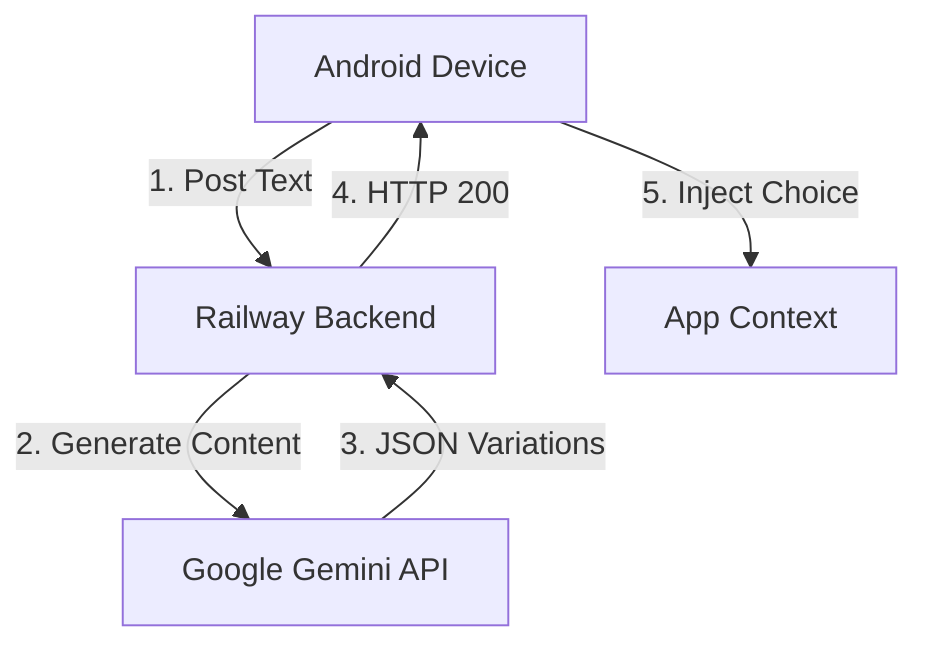

# Word Tone Keyboard ⌨️🤖

<p align="center">
  
   
  
</p>

<p align="center">
  
  
  
  
</p>

---

### 📝 Project Overview
**Word Tone** is a next-generation AI-integrated keyboard for Android. It enables users to rewrite their messages in real-time by leveraging Google's **Gemini AI** model. Whether you're aiming for a *professional* email or a *witty* tweet, Word Tone transforms your input directly from the keyboard.

---

### 🧱 System Architecture



---

### 🌟 Key Highlights

- **Standard QWERTY Layout**: Full keyboard with symbols and number rows.
- **On-the-Fly Rewriting**: Select your text and click "ReWrite".
- **Tone Presets**:
  - `Casual` - For friends and family.
  - `Professional` - For work and formal communication.
  - `Academic` - For research and study.
  - `Sarcastic` - For... you know.
- **Privacy First**: Only the highlighted text is sent for processing.

---

### 🚀 Quick Setup Guide

#### **Backend (Railway / Local)**
The backend is built with FastAPI and hosted on Railway.
1. Obtain a **Gemini API Key** from [Google AI Studio](https://aistudio.google.com/).
2. Set the `GEMINI_API_KEY` environment variable.
3. Deploy to Railway or run locally:
   ```bash
   cd backend
   pip install -r requirements.txt
   uvicorn main:app --host 0.0.0.0 --port 8080
   ```

#### **Android Application**
1. Open the project in **Android Studio**.
2. Build the project using Gradle.
3. Enable the "Word Tone" Keyboard in your device settings.
4. Set it as your default IME.

---

### 📂 Project Structure

```text
.
├── app/                  # Android Application (Kotlin)
│   ├── build.gradle      # Build configuration for Android
│   └── src/              # Main source code (IME Service)
├── backend/              # AI Service (FastAPI)
│   ├── main.py           # API logic & Gemini integration
│   ├── Dockerfile        # Container configuration
│   └── requirements.txt  # Python dependencies
├── images/               # App screenshots
│   ├── 1.jpeg            # Keyboard in action
│   ├── 2.jpeg            # AI Rewrite panel
│   └── 3.jpeg            # Suggestion list
├── .github/              # CI/CD Workflows
├── gradlew               # Gradle wrapper executable
└── README.md             # Project documentation
```

---

### 🎯 Roadmap
- [ ] Voice-to-Text with AI refinement.
- [ ] Auto-Correct powered by LLM context.
- [ ] Multi-language translation on-the-fly.

---

Developed with ❤️ by **amanjha112113**. 🚀
