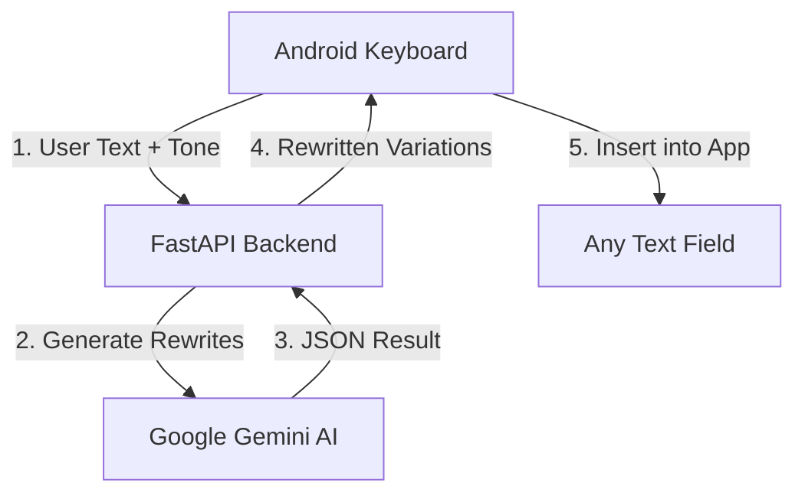

# Word Tone Keyboard ⌨️🤖


<p align="center">
  
   
  
</p>

---

## 📝 Project Overview
**Word Tone** is a premium, AI-powered custom keyboard for Android. It enables users to rewrite messages and correct grammar in real-time by leveraging Google's **Gemini AI**. With a modern **Google Stitch** inspired design, Word Tone provides a seamless and aesthetically pleasing writing experience across all Android apps.

---

## ✨ Key Features

### 🚀 AI Tone Transformation
Instantly rewrite any message into a variety of tones directly from your keyboard:
- **Professional**: Perfect for work emails and formal communication.
- **Casual**: For friendly, relaxed messaging.
- **Polite**: Soften your requests and messages.
- **Formal**: Traditional and structured language.
- **Gen-Z**: For staying current with trends.
- **Friendly**: Warm and approachable.

### ✍️ Advanced Grammar Correction
A dedicated **Grammar** mode that analyzes your input and provides 3 variations of perfectly corrected text. If your grammar is already perfect, it intelligently keeps your original message.

### 🎨 Modern Google Stitch UI
- **Dark Mode Design**: A sleek, material-inspired dark theme for eye comfort and aesthetic excellence.
- **Dynamic Carousel**: Easily scroll through all available AI tones with a custom-designed header.
- **Interactive Suggestions**: AI results appear as tappable, modern cards for instant insertion.
- **Fluid Layouts**: Pure XML-inflated layouts for high performance and smooth transitions.

### 😃 Emoji Support
Built-in **Emoji Keyboard** with quick access to 40+ common emojis, ensuring you never miss a beat in expression.

---

## 🧱 System Architecture



---

## 🚀 Quick Setup Guide

### 1. Backend (FastAPI)
The backend manages AI requests and state. It is designed to be hosted on Railway or locally.
1. Obtain a **Gemini API Key** from [Google AI Studio](https://aistudio.google.com/).
2. Set the `GEMINI_API_KEY` in your environment.
3. Run locally:
   ```bash
   cd backend
   pip install -r requirements.txt
   uvicorn main:app --host 0.0.0.0 --port 8000
   ```

### 2. Android Application
1. Open the project in **Android Studio**.
2. Update the `BASE_URL` in `Constants.kt` to point to your backend.
3. Build and deploy to your emulator or device.
4. Enable **Word Tone Keyboard** in Settings → System → Languages & Input.

---

## 📂 Project Structure

```text
.
├── app/                  # Android (Kotlin/XML)
│   ├── src/main/java/    # Keyboard & API logic
│   ├── src/main/res/     # Google Stitch Layouts & Drawables
│   └── src/main/xml/     # QWERTY, Symbols & Emoji layouts
├── backend/              # AI Service (Python FastAPI)
│   ├── main.py           # Gemini integration & Tone logic
│   └── requirements.txt  # Dependencies (google-genai, fastapi)
└── README.md             # Documentation
```

---

## 🎯 Roadmap
- [ ] **Smart Auto-Correct**: LLM-context aware error correction.
- [ ] **Multi-Language Translation**: Translate text on-the-fly.
- [ ] **Voice-to-AI**: Voice input that automatically refines into formal/casual text.

---

Developed with ❤️ by **amanjha112113**. 🚀
