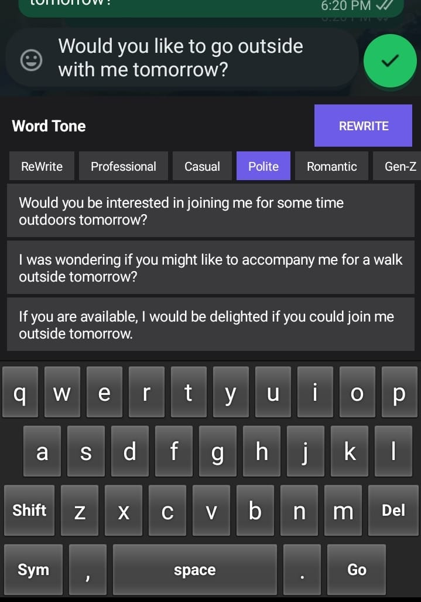
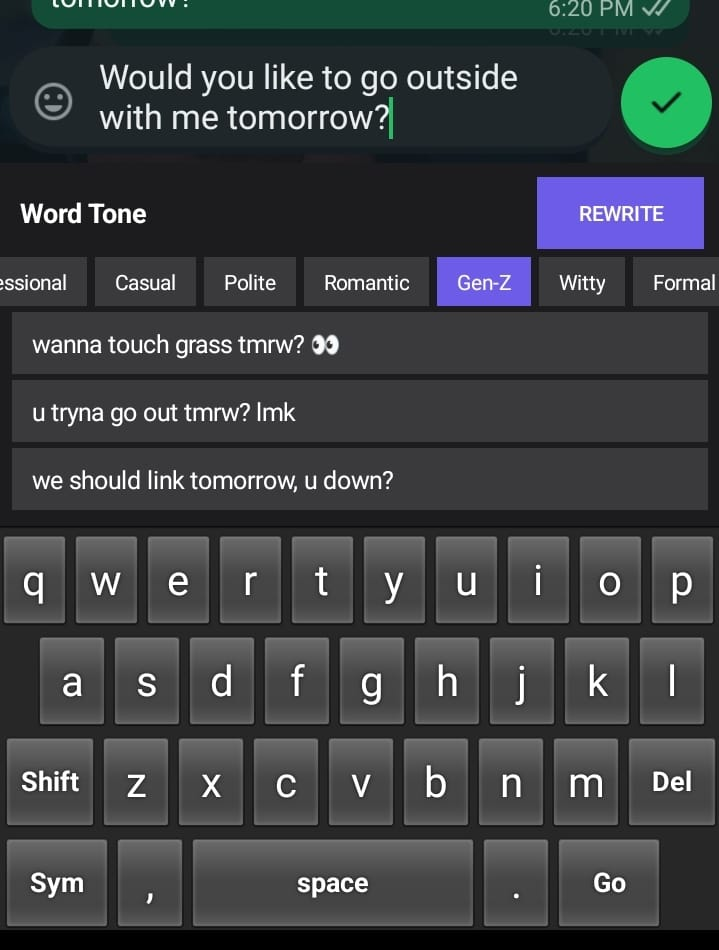
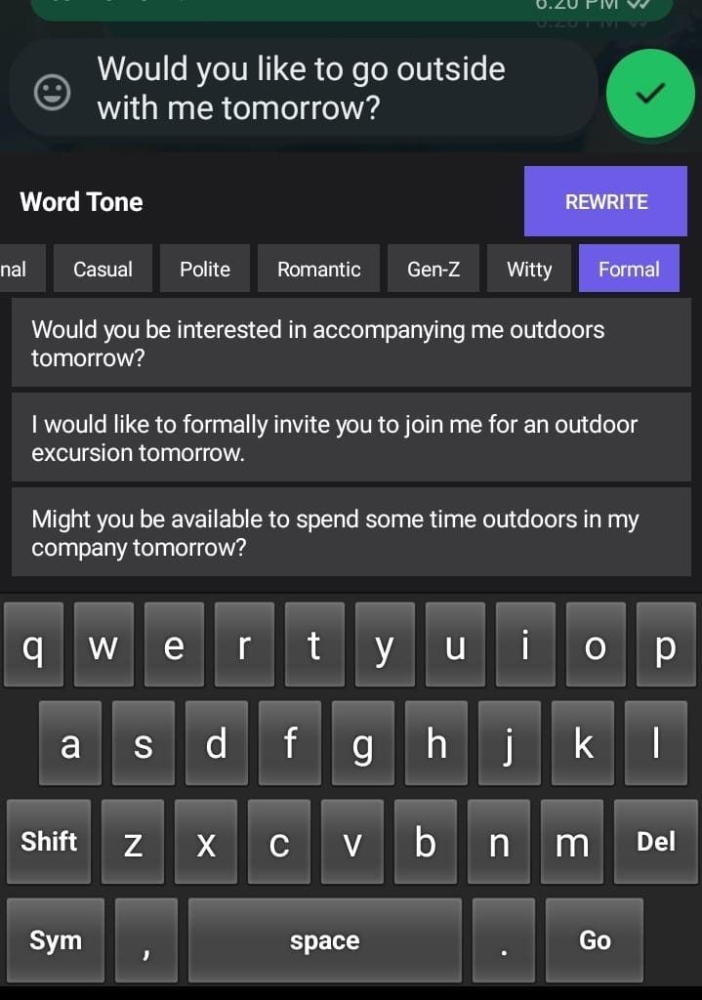

# Word Tone Keyboard

[](https://developer.android.com/about)
[](https://kotlinlang.org/)
[](https://fastapi.tiangolo.com/)
[](https://ai.google.dev/)
[](https://github.com/Amanjha112113/wordtone-api/actions)

Word Tone is a high-performance, edge-integrated AI transcription and rewriting engine delivered as a custom Android Input Method. It leverages large language models (LLMs) to provide real-time syntactic refinement, tone adjustment, and grammatical sanitization across the entire Android ecosystem.

---

## 🏗 Engineering Architecture

Word Tone is designed as a distributed system, separating high-latency generative AI computation from the low-latency interactive keyboard interface.

<p align="center">
  
   
  
  <br>
  <em>Word Tone in action: QWERTY Layout, AI Tone Selection, and Real-time Suggestions.</em>
</p>

### 1. **Client Layer (Android IME)**
*   **IMF Integration**: Inherits from `InputMethodService` to interact with the Android Input Method Framework, ensuring global accessibility across all input fields.
*   **Dynamic UI Inflation**: Utilizes native binary XML inflation to minimize view creation latency and memory overhead during layout transitions.
*   **Asynchronous Processing**: All network I/O is offloaded to **Kotlin Coroutines** with a dedicated `Dispatchers.IO` pool, preventing UI thread blocking and ensuring a fluid 60FPS typing experience.
*   **Networking Stack**: Powered by **Retrofit 2** and **OkHttp 4**, featuring robust connection pooling and timeout management.

### 2. **Orchestration Layer (FastAPI Backend)**
*   **Concurrency Model**: Built on **Python 3.11+** with `asyncio`, enabling non-blocking execution of concurrent AI generation requests.
*   **Multi-Model Resiliency**: Features a sophisticated failover mechanism that rotates through multiple Gemini models (1.5 Flash, 2.0 Flash Exp) to handle API-specific constraints or performance degradation.
*   **Load Balancing & Quota Management**: Implements an intelligent key-rotation system that dynamically tracks API quotas and triggers a 24-hour cooldown for exhausted endpoints.

---

## 🚀 Key Capabilities

*   **⚡ Generative Rewrite**: Transforms raw text into professional, casual, polite, or stylized variations in under 800ms.
*   **🔍 Contextual Grammar Sanitization**: Deep structural analysis of sentences to provide 3 distinct variations of grammatically sound text.
*   **🤩 Adaptive UI**: A modern, dark-themed interface that responds to user focus and provides immediate AI suggestion feedback.
*   **😀 Native Emoji Integration**: Seamlessly switches between alpha-numeric, symbol, and emoji layouts without layout jank.

---

## ⚡ Performance Optimization

We prioritize a low footprint to ensure Word Tone remains the most reliable input method on any device:
*   **Memory Footprint**: Optimized drawable resources and view recycling keep the application under 50MB of RAM during peak usage.
*   **Network Efficiency**: Responses are compressed and strictly typed in JSON format, minimizing payload size and deserialization time.
*   **Cold Start Latency**: Modular architecture ensures that the IME service initializes only essential components upon system boot.

---

## 🛡 Security & Privacy

Word Tone is built with a **Privacy-First** engineering philosophy:
*   **Zero Retention**: The backend does not persist any user input. Text is processed in-memory and immediately discarded after a successful response.
*   **Encrypted Transport**: All communication between the keyboard and orchestration layer is secured via TLS/SSL.
*   **Credential Isolation**: Sensitive API keys are managed exclusively through environment variables and are never hardcoded or exposed in the client.

---

## 🛠 Local Development & Contribution

### Prerequisites
*   **Android Development**: JDK 17+, Android SDK 34+.
*   **Backend Development**: Python 3.10+, Virtualenv.
*   **API Access**: A valid Gemini API Key from [Google AI Studio](https://aistudio.google.com/).

### Installation Steps
1.  **Clone the Repository**:
    ```bash
    git clone https://github.com/Amanjha112113/wordtone-api.git
    cd wordtone-api
    ```
2.  **Initialize Backend**:
    ```bash
    cd backend
    pip install -r requirements.txt
    python -m uvicorn main:app --reload
    ```
3.  **Build Android Client**:
    Open the root directory in **Android Studio**, sync Gradle, and deploy the `app` module to your device.

---

Developed and maintained by **amanjha112113**. 🚀
